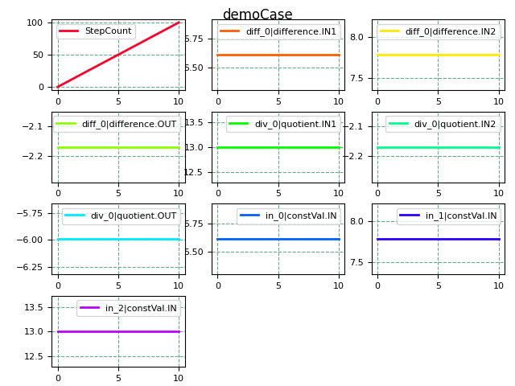

# watchDict

## Description

A watchDict is a file in dictIO dict file format used with cosim and watchCosim.

A watchDict is suitable for
* monitor the progress of a running cosim simulation
* show a self defined convergence plot on the screen and save the image
* write a statistical summary of the results (as defined in watchDict and as far as the simulation has progressed).

A default watchDict is written during opsCaseBuilder's build process covering all information from the involved fmu's.
The user can opt to reduce and / or adjust the default watchDict's content afterwards manually (or by a user defined tool / process).

## Elements

| element / key         | type      | Description |
| :-------------------- | :-------- | :---------- |
| datasources           | dict      | {all, any, none} names of the involved fmu's |
| &numsp;\<FMU>         | dict      | key matching the name of an FMU to be monitored (without file extension) |
| &numsp;&numsp;columns | list[int] | columns as they are written in \<FMU>_DATETIME.csv (sub-setting and ordering is free-of-choice)  |
| delimiter             | string    | the type of delimiter in \<FMU>_DATETIME.csv |
| simulation            | dict      | additional information about the monitored simulaton. Used for window decoration. |
| &numsp;name           | string    | name of the monitored simulation |

## Related files
* ./watchDict
* results/resultDict
* results/dataFrame.dump
* results/SIMULATIONNAME.png

## Example

Below example shows a typical watchDict file.

~~~js
/*---------------------------------*- C++ -*----------------------------------*\
filetype dictionary; coding utf-8; version 0.1; local --; purpose --;
\*----------------------------------------------------------------------------*/
datasources
{
    myfmu
    {
        columns
        (
            0                 1                 2                 3                 4
        );
    }
}
delimiter                     ,;
simulation
{
    name                      demoCase;
}
~~~
